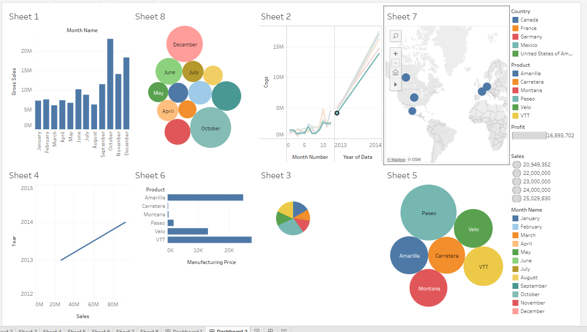

# Tableau Dashboard — "Dashboard 2"

This dashboard was built in Tableau Desktop from the cleaned Financial
Sample dataset (`data/cleaned_financial_data.csv`) and is included here as a
screenshot (`tableau_dashboard.png`) since Tableau workbooks require a
licensed desktop install to open/edit. Rebuild steps are below if the
`.twbx` needs to be regenerated from scratch.

## Layout

| Sheet | Chart type | What it shows |
|---|---|---|
| Sheet 1 | Bar chart | Gross Sales by Month Name (Jan–Dec), highlights the Oct/Dec seasonal peaks |
| Sheet 2 | Line chart | COGS trend by Month Number, split/colored by Year of Date (2013 vs 2014) |
| Sheet 3 | Pie chart | Sales mix (categorical breakdown, filtered by the same dimensions as the rest of the dashboard) |
| Sheet 4 | Line chart | Sales trend by Year (2012–2015 axis, actual data 2013–2014) |
| Sheet 5 | Packed bubbles | Sales by Product (Paseo, VTT, Carretera, Amarilla, Velo, Montana) — bubble size = Sales |
| Sheet 6 | Horizontal bar | Manufacturing Price by Product |
| Sheet 7 | Symbol map | Profit by Country, plotted geographically (bubble size = Profit) |
| Sheet 8 | Packed bubbles | Gross Sales by Month Name — bubble size = Sales, highlights Oct/Dec/June as largest |

**Global filters** (right-hand panel, apply to every sheet): Country,
Product, Profit (range slider), Sales (range slider), Month Name.

**Headline KPI:** Total Profit = **$16,893,702** — reconciles exactly with
the Python/SQL pipeline and the Excel dashboard (`excel_dashboard/Financial_Analysis_Dashboard.xlsx`,
`Dashboard` tab, "Total Profit" tile).

## How to rebuild in Tableau Desktop

1. Open Tableau Desktop → **Connect** → Text File → `data/cleaned_financial_data.csv`.
2. Build each sheet listed above using the standard drag-and-drop shelf
   (Rows/Columns/Marks) — no calculated fields are required since every
   field used (Sales, Profit, COGS, Segment, Country, Product, Month
   Name/Number, Year) already exists in the cleaned CSV.
3. Combine all 8 sheets into a new **Dashboard**, add the Country, Product,
   Profit, Sales, and Month Name filters, and apply them to all sheets
   ("Apply to Worksheets → All Using This Data Source").
4. **File → Export Packaged Workbook (.twbx)** to produce a single portable
   file if a native Tableau file is required for submission.
